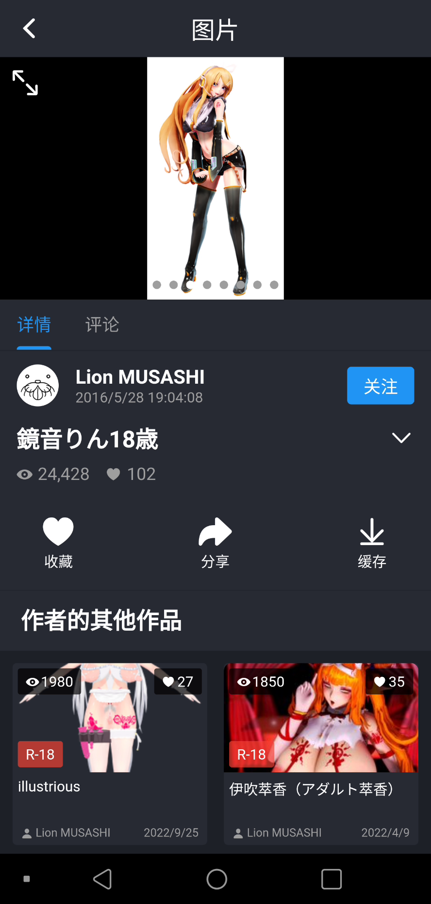

# IwrQk 

IwrQk is a cross-platform application based on Flutter that is compatible with the new version of Iwara (a video sharing platform).

## Features

Cross-platform support for iOS and Android.

## Screenshots

|  |  |  | 
|:---:|:---:|:---:|

## Contributions

If you encounter any bugs, please report them after ruling out all network-related causes, as Iwara's servers often experience errors.
